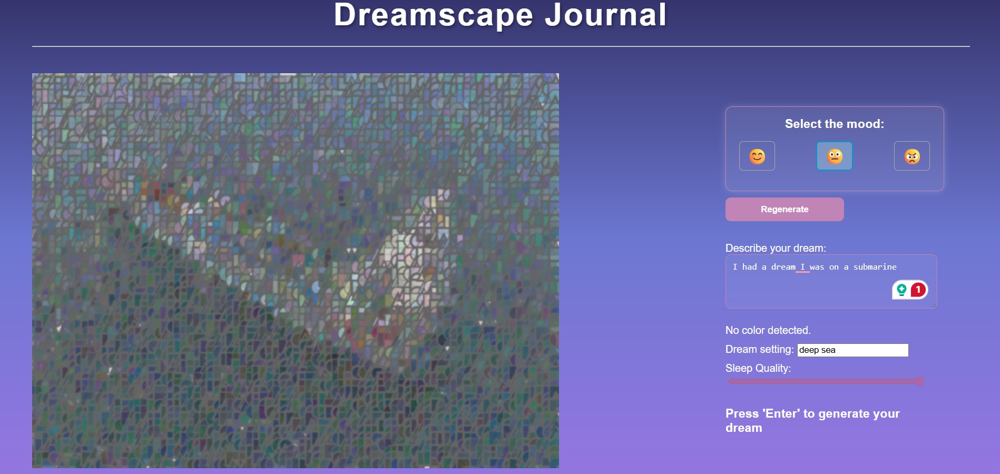

# Dreamscape Journal 🌙  
**Final Project for CMPM 147 - Spring 2025**  
By Team Dragon: Lorraine Torres, Zosia Trela, Hojoun Yoon, Leonidas Assimes, JC Zaragoza  
Date: 6/9/2025  

---

## Overview

Dreamscape Journal is an interactive webpage that acts like a virtual dream journal. Users type a short description of their dream, pick a setting and mood, and adjust a sleep quality slider. Based on their input, the site generates an abstract, animated "dreamscape" that visually represents the dream.

We aimed to explore how code and design can represent dreams, which are something deeply emotional and often difficult to describe, by using color, motion, and composition.

---

##  Features

- **Text-Based Generation:** Dreamscapes are created using keywords and the length of your dream description.
- **Mood Selector:** Changes the color palette, shapes, and movement of the dreamscape.
- **Sleep Quality Slider:** Lower sleep quality = blurrier dreamscapes.
- **Emergent Art:** No two dreamscapes are alike—each input results in a unique generative output.
- **Live Animation:** Dreamscapes gently mutate and animate over time for a dreamy effect.

---

## Tech Stack

- **p5.js** – for canvas drawing, animation, and rendering
- **Pexels API** – fetches background images based on the dream's setting
- **JavaScript (ES6)** – core logic and interaction handling
- **HTML/CSS** – structure and styling

---

## Links

- **Live site:** [Dreamscape Journal](https://jzara3115.github.io/CMPM147_DreamJournal/)  
- **Source code:** [GitHub Repository](https://github.com/jzara3115/CMPM147_DreamJournal)

---

## How It Works

1. **Input Your Dream**  
   Type a short description and setting (like "forest" or "beach"). The system analyzes your text for color keywords and length to influence the layout.

2. **Pick a Mood**  
   Choose between *happy*, *neutral*, or *bad*. Each affects shapes, colors, and animation.

3. **Adjust Sleep Quality**  
   Use the slider to control blur—lower quality means more blur and dreamlike distortion.

4. **Generate Dreamscape**  
   Hit "Enter" to generate your dreamscape. You can press it again to regenerate or edit your input.

---

## Key Components

- **Text Analysis:** Detects color words and hashes text length to vary shape count and size.
- **Image Integration:** Uses setting input to fetch a relevant image from Pexels.
- **Mood States:** Influences colors, shape type, stroke, and animation behavior.
- **Procedural Mutation:** Shapes continuously shift and change over time.
- **Sleep Blur:** A blur filter is applied based on sleep slider value (0–100).

---

## Example Dream

> I wandered through a quiet forest, where silver mist curled around ancient trees and moonlight danced on moss-covered stones. The air shimmered with a soft hum, and glowing fireflies floated like tiny stars...

- **Setting:** `forest`  
- **Mood:** `neutral`  
- **Sleep Quality:** 70

Try pasting that into the site to see the dreamscape evolve!

---

## Challenges

- Managing a large team with busy schedules.
- Solved with weekly syncs, task delegation, and Friday integration sessions.
- Balancing visual unpredictability (emergence) with meaningful representation.

---

## Screenshots

---

Thanks for checking out Dreamscape Journal!